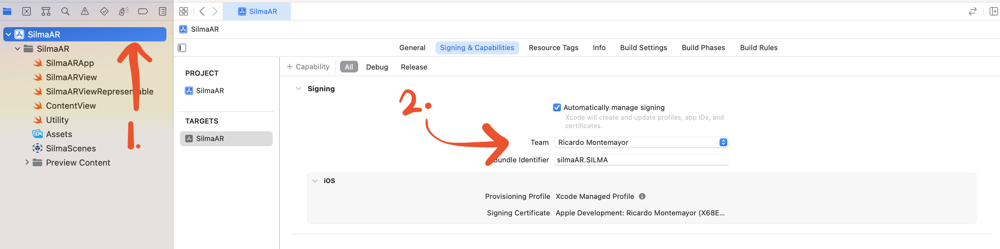

# :selfie: AR App para Silma 

Una aplicación móvil de realidad aumentada (AR) que se utilizará en el stand editorial de Grupo Silma durante la feria del libro en Monterrey. El objetivo de la aplicación es generar conciencia sobre los libros, personajes y eventos editoriales.

## Prerrequisitos
1. 💻 **MacOS**: se necesita un sistema operativo MacOS para desarrollar aplicaciones para iOS.

2. 📱 **Dispositivo iOS**: se necesita un dispositov iOS (iPhone, iPad, etc.) con una versión mínima de iOS 16.0 para correr la aplicación.

3. 🔨 **Xcode**: el entorno de desarrollo integrado (IDE) para macOS que contiene un conjunto de herramientas de desarrollo de software de Apple para el desarrollo de software para macOS, iOS, iPadOS y watchOS. Puedes descargarlo de la [App Store](https://apps.apple.com/us/app/xcode/id497799835?mt=12).

## Configuración del Proyecto
1. **Clonar el repositorio**: Para obtener una copia local del código, puedes clonarlo usando el siguiente comando de terminal:

  ```bash
  git clone https://github.com/Quiqueev/Silma.git
  ```
  
2. **Abrir el proyecto**: Navega a la carpeta donde clonaste el repositorio y abre el archivo `SilmaAR.xcodeproj` con Xcode.

3. **Configurar el equipo de desarrollo**: Dentro de Xcode, navega a la pestaña "General" del proyecto, busca la sección "Signing & Capabilities" y selecciona tu equipo de desarrollo en el menú desplegable.

  
 
4. **Ejecutar el proyecto**: Finalmente, puedes ejecutar el proyecto en un simulador de iOS haciendo clic en el botón "Run" en la esquina superior izquierda de la ventana de Xcode o presionando `Cmd + R`.
